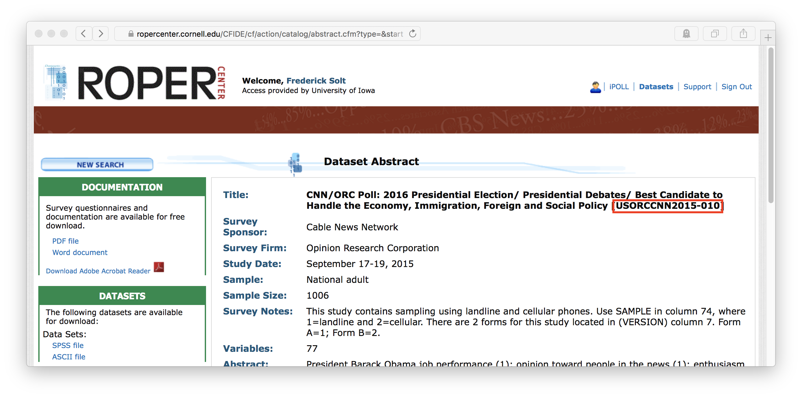

The [Roper Center for Public Opinion Research](http://ropercenter.cornell.edu), in its own words, works "to collect, preserve, and disseminate public opinion data; to serve as a resource to help improve the practice of survey research; and to broaden the understanding of public opinion through the use of survey data in the United States and around the world."  It maintains the largest archive of public opinion data in existence, holding data dating back to the 1930s and from over 100 countries.  Researchers taking advantage of these datasets, however, are caught in a bind.  The terms and conditions for downloading any Roper Center dataset state that datasets "may not be resold or re-disseminated."[^1] But to ensure that one's work can be reproduced, assessed, and built upon by others, one must provide access to the raw data one employed.  

The `ropercenter` package cuts this knot by providing programmatic, reproducible access to the Roper Center's datasets from within R for [registered users](https://ropercenter.cornell.edu/make-personalized-account/) at the Roper Center's [member institutions](https://ropercenter.cornell.edu/list-of-members/).  

Please remember that by using Roper Center services, you accept all of the Center's [Terms and Conditions](https://ropercenter.cornell.edu/CFIDE/cf/action/registration/termsAndConditions.cfm).
 

## Setup

When used interactively, the `roper_download` function will ask for the login information required by the Roper Center: the registered user's email and password. 
After that information is input once, it will be entered automatically for any other download requests made in the same session.  To change this contact information within a session, one may set the argument `reset` to `TRUE` when running `roper_download` again, and the function will again request the required information. 

An optional, but highly recommended, setup step is to add the information the Roper 
Center requires to your [.Rprofile](http://www.statmethods.net/interface/customizing.html) as in the following example:

```{r eval = FALSE}
options("roper_email" = "juanita-herrera@uppermidwest.edu",
        "roper_password" = "password123!")
```

The `roper_download` function will then access the information it needs to pass on to the Roper Center by default.  This means that researchers will not have to expose their info in their R scripts and that others reproducing their results later---given that they have registered as users with the Roper Center---will be able to execute those R scripts without modification.  (They will, however, need to enter their own information either interactively or in their own .Rprofiles, a detail that should be noted in the reproducibility materials to avoid confusion.)


## Use
The `roper_download` function (1) simulates a visit to the Roper Center's sign-in page, (2) enters the required information to sign in, (3) navigates to a specified dataset and downloads the dataset's files, and, optionally but by default, (4) converts the dataset's files to `.Rdata` format.

Datasets are specified using the `file_id` argument.  The Roper Center uses a unique number to identify each of its datasets; this number is consistently listed alongside the dataset's name.  For this [CNN/ORC poll on the 2016 presidential election](https://ropercenter.cornell.edu/CFIDE/cf/action/catalog/abstract.cfm?type=&start=&id=&archno=USORCCNN2015-010&abstract=), for example, the file id is USORCCNN2015-010:



To reproducibly download this dataset:

```{r eval=FALSE}
roper_download(file_id = "USORCCNN2015-010")
```

Multiple datasets may be downloaded from the same research area in a single command by passing a vector of ids to `file_id`.  The following downloads the above-described CNN/ORC poll along with two similar polls conducted earlier in the campaign:

```{r eval=FALSE}
roper_download(file_id = c("USORCCNN2015-010", "USORCCNN2015-009", "USORCCNN2015-008"))
```

After the needed datasets are downloaded, they are, by default, converted to `.RData` format (via `haven::read_por` if possible, `foreign::read.spss` otherwise) and ready to be loaded into R using `load()` or `rio::import()`.

```{r eval=FALSE}
orccnn2015_010 <- rio::import("roper_data/USORCCNN2015-010/USORCCNN2015-010.RData")
```

[^1]: The terms _do_ include the exception that "researchers who are actively collaborating with individuals at non-member institutions may provide a copy of relevant data sets to their collaborators solely for their private use in connection with and for the duration of the project, after which they will return or destroy such material," but the limitation to active collaboration renders this inadequate for the public provision of materials for reproducibility.
