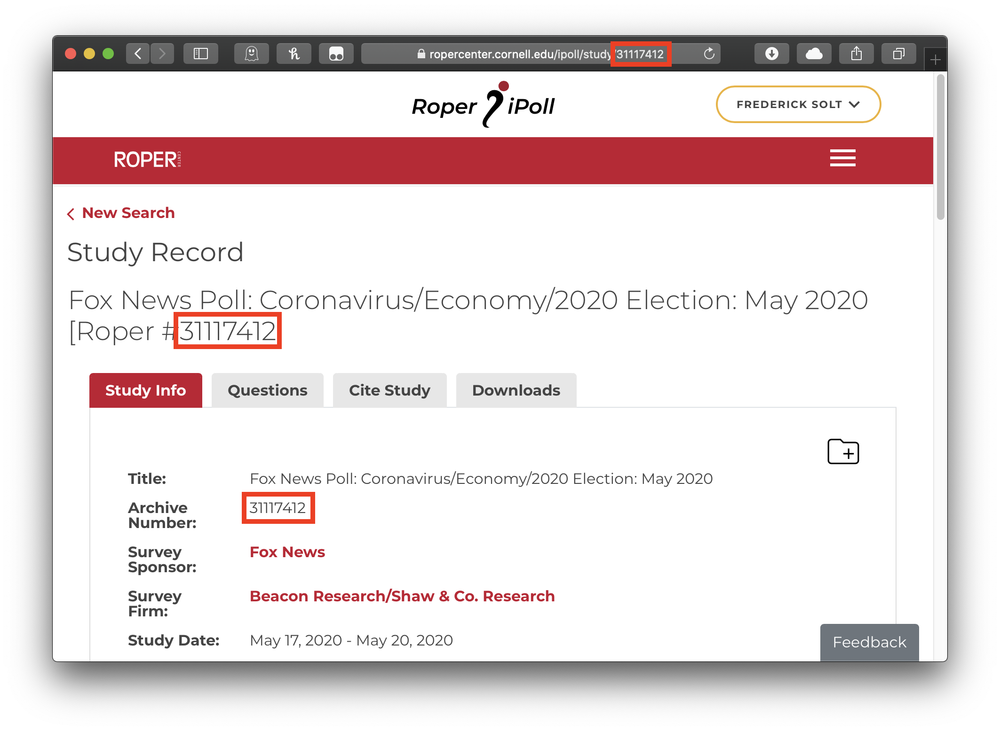
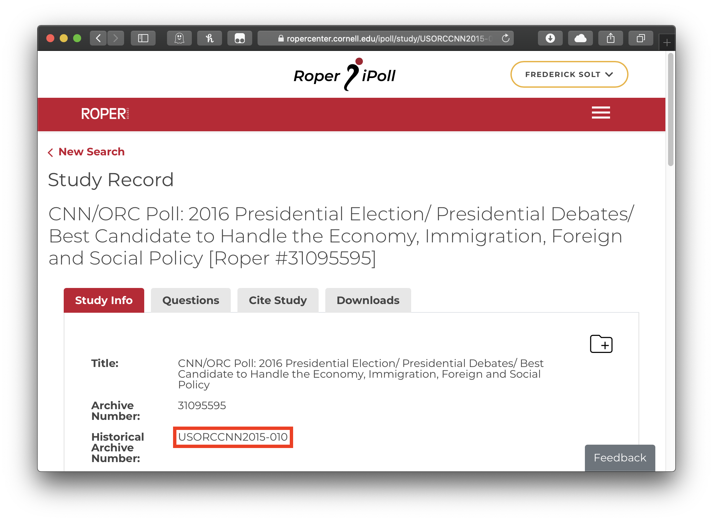

The [Roper Center for Public Opinion Research](http://ropercenter.cornell.edu), in its own words, works "to collect, preserve, and disseminate public opinion data; to serve as a resource to help improve the practice of survey research; and to broaden the understanding of public opinion through the use of survey data in the United States and around the world."  It maintains the largest archive of public opinion data in existence, holding data dating back to the 1930s and from over 100 countries.  Researchers taking advantage of these datasets, however, are caught in a bind.  The terms and conditions for downloading any Roper Center dataset state that datasets "may not be resold or re-disseminated."[^1] But to ensure that one's work can be reproduced, assessed, and built upon by others, one must provide access to the raw data one employed.  

The `ropercenter` package cuts this knot by providing programmatic, reproducible access to specified Roper Center datasets from within R for [registered users](https://ropercenter.cornell.edu/ipoll/login) at the Roper Center's [member institutions](https://ropercenter.cornell.edu/membership/list-members/).  

Please remember that by using Roper Center services, you accept all of the Center's [Terms and Conditions](https://ropercenter.cornell.edu/roper-center-data-archive-terms-and-conditions).
 

## Setup

The `ropercenter` package interacts with the Roper Center website using the latest version of the Chrome browser.  [Get (or update) Chrome here](https://www.google.com/chrome/).

When used interactively, the `roper_download` function will ask for the login information required by the Roper Center: the registered user's affiliation, email, and password. 
After that information is input once, it will be entered automatically for any other download requests made in the same session.  To change this contact information within a session, one may set the argument `reset` to `TRUE` when running `roper_download` again, and the function will again request the required information. 

An optional, but highly recommended, setup step is to add the information the Roper 
Center requires to your [.Rprofile](http://www.statmethods.net/interface/customizing.html) as in the following example:

```{r eval = FALSE}
options("roper_email" = "juanita-herrera@uppermidwest.edu",
        "roper_password" = "password123!")
```

The `roper_download` function will then access the information it needs to pass on to the Roper Center by default.  This means that researchers will not have to expose their info in their R scripts and that others reproducing their results later---given that they have registered as users with the Roper Center---will be able to execute those R scripts without modification.  (They will, however, need to enter their own information either interactively or in their own .Rprofiles, a detail that should be noted in the reproducibility materials to avoid confusion.)


## Use
The `roper_download` function (1) simulates a visit to the Roper Center's sign-in page, (2) enters the required information to sign in, (3) navigates to a specified dataset and downloads the dataset's files, and, optionally but by default, (4) converts the dataset's Stata- or SPSS-formated files to `.Rdata` format.

Datasets are specified using the `file_id` argument.  The Roper Center uses a unique 'archive number' to identify each of its datasets; this number is consistently listed alongside the dataset's name and under the Study Info tab.  For this [Fox News poll on the 2020 U.S. presidential election](https://ropercenter.cornell.edu/ipoll/study/31117412), for example, the file id is 31117412:



To reproducibly download this dataset:

```{r eval=FALSE}
roper_download(file_id = "31117412",
               download_dir = tempdir()) # remember to specify a directory for your download
```

Most older surveys also have a Roper 'historical archive number' that may also be used as the file id.  This [CNN/ORC poll on the 2016 U.S. presidential election](https://ropercenter.cornell.edu/ipoll/study/USORCCNN2015-010) can be downloaded using either its archive number, 31095595, or its historical archive number, USORCCNN2015-010, as the file id:



Downloading with the historical archive number as the file id:

```{r eval=FALSE}
roper_download(file_id = "USORCCNN2015-010",
               download_dir = tempdir()) # remember to specify a directory for your download
```


Multiple datasets may be downloaded from the same research area in a single command by passing a vector of ids to `file_id`.  The following will download both of the above-described polls:

```{r eval=FALSE}
roper_download(file_id = c("31117412", "USORCCNN2015-010"),
               download_dir = tempdir()) # remember to specify a directory for your download
```

After the needed datasets are downloaded, if they are in Stata or SPSS format, they are by default converted to `.RData` format (via `haven::read_dta` if possible, `haven::read_por` or `foreign::read.spss` otherwise) and ready to be loaded into R using `load()` or `rio::import()`.

```{r eval=FALSE}
orccnn2015_010 <- rio::import(file.path(tempdir(), "USORCCNN2015-010","USORCCNN2015-010.RData"))
```

For many older surveys, however, no Stata- or SPSS-formatted datasets are available, only `.dat` ASCII files.
The next section describes how to use `ropercenter`'s `read_ascii` function to make this data usable.

## Advanced Use: ASCII Datasets
Many older Roper Center datasets are available only in ASCII format, which is notoriously difficult to work with.
The `read_ascii` function facilitates the process of extracting selected variables from ASCII datasets.
For single-card files, such as this Gallup Poll from June 1982, one can simply identify the names, positions, and widths of the needed variables from the codebook and pass them to `read_ascii`'s `var_names`, `var_positions`, and `var_widths` arguments.
The resulting data frame will include these variables plus a variable for the respondent id number and one that encodes the raw data as a single string.

```{r eval=FALSE}
roper_download("USAIPO1982-1197G", # Gallup Poll for June 25-28, 1982 (ASCII only)
               download_dir = tempdir())  # remember to specify a directory for your download

gallup1982 <- read_ascii(file = file.path(tempdir(), "USAIPO1982-1197G",
                                          "1197.dat"),
                         var_names = c("q09j", "weight"),
                         var_positions = c(38, 1),
                         var_widths = c(1, 1))
```

Multicard datasets are more complicated.
In the best case, the file contains one line per card per respondent; then, the user can extract the needed variables by adding only the `var_cards` and `total_cards` arguments.
When this condition is violated---there is not a line for every card for every respondent, or there are extra lines---the `read_ascii` function will throw an error and request the additional arguments `card_pattern` and `respondent_pattern`.
These take [regular expressions](https://r4ds.had.co.nz/strings.html#matching-patterns-with-regular-expressions) that match the card and respondent identifiers on each line in the original file (note that [look-behind assertions](https://www.regextutorial.org/positive-and-negative-lookbehind-assertions.php) are often particularly handy for constructing these regexs).
Either way, the resulting data frame will include the variables specified in the `var_` arguments, a variable for the respondent id number, and as many additional variables as cards in the file, each of which encodes the raw data on that card as a single string.

```{r eval=FALSE}
roper_download("USAIPOCNUS1996-9603008", # Gallup/CNN/USA Today Poll: Politics/1996 Election (ASCII only)
               download_dir = tempdir())  # remember to specify a directory for your download

gallup1996 <- read_ascii(file = file.path(tempdir(), "USAIPOCNUS1996-9603008",
                                          "a9603008.dat"),
                         var_names = c("q43a", "q44", "weight"),
                         var_cards = c(6, 6, 1),
                         var_positions = c(62, 64, 13),
                         var_widths = c(1, 1, 3),
                         total_cards = 7,
                         card_pattern = "(?<=^.{10})\\d", # a digit, preceded by the start of the line and ten other characters
                         respondent_pattern = "(?<=^\\s{2})\\d{4}") # four digits, preceded by the start of the line and two whitespace characters
```

[^1]: The terms _do_ include the exception that "researchers who are actively collaborating with individuals at non-member institutions may provide a copy of relevant data sets to their collaborators solely for their private use in connection with and for the duration of the project, after which they will return or destroy such material," but the limitation to active collaboration renders this inadequate for the public provision of materials for reproducibility.
